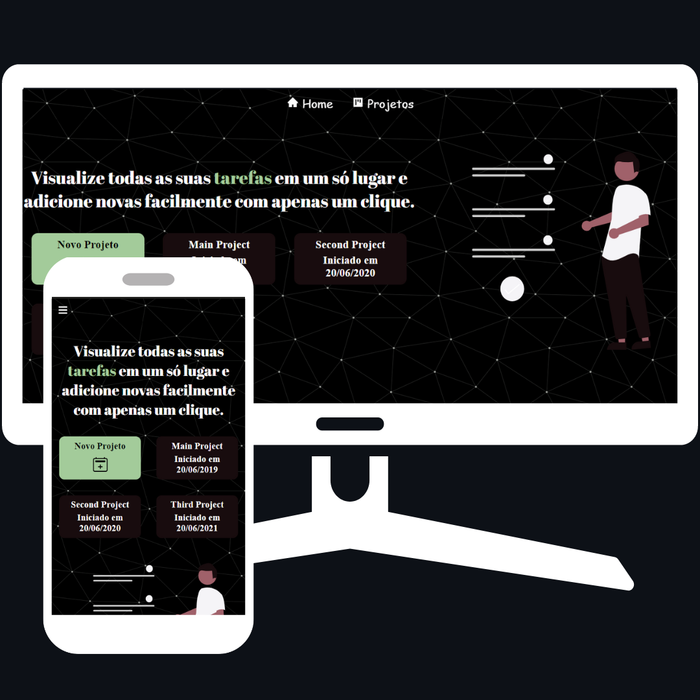

# Frontend To-Do List

This is the frontend part of a To-Do List project, a web application that allows users to create, read, update and delete to-do list items. The frontend was developed using HTML, CSS, JavaScript and Yarn.

Table of Contents
=================
<!--ts-->
   * [Description](#description)
   * [Technologies](#technologies)
   * [Installation](#installation)
   * [Usage](#usage)
   * [Deployed Website](#deployed-website)
   * [Contributing](#contributing)
   * [License](#license)
   * [Contact](#contact)
<!--te-->

# Description

The Frontend To-Do List project is a web application that allows users to manage their to-do lists efficiently. It features a simple, user-friendly interface that allows users to add, view, update and delete tasks easily. The application is built using HTML, CSS and JavaScript, and the package manager Yarn is used to manage dependencies.

The project was developed as a learning exercise to practice frontend development skills. It is a great example of how to use modern frontend technologies to create a functional and visually appealing web application.

[https://lista-de-tarefas-jonas.netlify.app/](https://lista-de-tarefas-jonas.netlify.app/)

# Technologies

The following technologies were used in this project:

* HTML;
* CSS;
* JavaScript;
* react.JS;
* Axios
* Yarn
* VS Code
* Netlify

# Installation

To install and run this project, follow these steps:

1. Clone the repository: `git clone https://github.com/jonasmachados/frontend-to-do-list.git `

2.  Install the dependencies: `yarn install`

# Usage

To run the project, use the following command: `yarn start`

# Deployed Website

The project is deployed and can be accessed at the following URL:

[https://lista-de-tarefas-jonas.netlify.app/](https://lista-de-tarefas-jonas.netlify.app/)

# Contributing

Contributions are welcome! If you find any bugs or have suggestions for new features, please open an issue on the GitHub repository.

# License

This project is licensed under the MIT License. See the LICENSE file for more information.

# Contact

If you want to contact me, you can reach me at:

* LinkedIn: https://www.linkedin.com/in/jonas-machados/
* Email: jonasmachado.ti@gmail.com